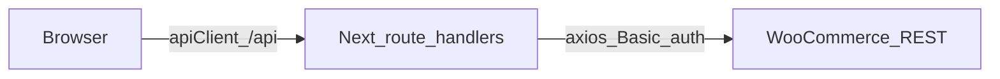

# Architecture — Sokany Store

## العربية

واجهة المتجر مبنية على **Next.js (App Router)** كطبقة أمامية و**Backend-for-Frontend (BFF)**: المتصفح يتحدث فقط مع مسارات `app/api/*` على نفس النطاق، و**مفاتيح WooCommerce لا تُعرَض للعميل** (`WC_CONSUMER_*` و`WC_BASE_URL` بيئة خادم فقط). التنظيم يفضّل **مجلدات حسب الميزة** (`features/<domain>/`) مع خطافات مشتركة و`schemas/` للـ Zod.

**صيانة:** عند إضافة مسارات API أو تغيير تدفق البيانات، حدّث هذا الملف أو [`docs/api-integration-inventory.md`](api-integration-inventory.md) في نفس الـ PR.

---

## English — Stack & versions

Pinned versions: [`package.json`](../package.json). Summary: Next.js App Router, React, TanStack Query, Zustand, Zod, WooCommerce REST behind Route Handlers — see [`README.md`](../README.md).

---

## English — Repository layout (contract)

From [`.cursorrules`](../.cursorrules):

| Area | Path |
|------|------|
| UI primitives | `components/ui` |
| Shell / chrome | `components/layout` |
| Shared page assembly | `components/pages` |
| Domain code | `features/<domain>/{components,hooks,services,store,...}` |
| Shared hooks | `hooks/` |
| Cross-cutting Zod | `schemas/` |

No assumed global `services/` root unless introduced deliberately.

---

## English — Data flow

UI → hooks → `features/*/services` → `GET/POST /api/*` (see [`lib/api-client.ts`](../lib/api-client.ts)) → Route Handlers → WooCommerce REST via [`lib/create-woo-client.ts`](../lib/create-woo-client.ts).

Mock mode: `NEXT_PUBLIC_USE_MOCK` short-circuits some client paths ([`lib/constants.ts`](../lib/constants.ts)).

Full route map: [`docs/api-integration-inventory.md`](api-integration-inventory.md).

---

## English — Storefront vs Control

- **Storefront:** public routes under `app/(storefront)/…` (and related segments), SEO metadata, catalog, checkout.
- **Control:** `/control/*` admin UI; session enforced in [`proxy.ts`](../proxy.ts) (Next.js **App Router proxy**, successor to `middleware.ts`; redirect to `/control/login` when unauthenticated). APIs under `app/api/control/*` expect control session / scopes.

---

## Related

- [`docs/woo-integration.md`](woo-integration.md) — env, webhooks, BFF details
- [`docs/caching-strategy.md`](caching-strategy.md) — `revalidateTag`, `unstable_cache`
- [`docs/frontend-guidelines.md`](frontend-guidelines.md) — UI patterns
