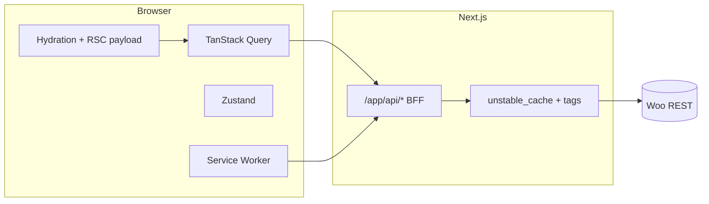

# Enterprise audit — Sokany Store (2026)

Concise technical audit of the Next.js + WooCommerce headless storefront: architecture, risks, priorities, and how to benchmark. Aligns with [`docs/project-vision.md`](./project-vision.md) and [`docs/tech-audit.md`](./tech-audit.md).

---

## 1. Architecture (data flow)

| Layer | Role |
|--------|------|
| **App Router** | Server Components fetch CMS (`getPublicSiteContent`), categories/products (`getCategoriesServer`, `getProductsListServer`), dehydrate TanStack Query on the home route; layouts inject JSON-LD and `SiteShell`. |
| **Route handlers** (`app/api/*`) | BFF for WooCommerce: `unstable_cache` + tags on list endpoints (e.g. products `revalidate: 300`), Zod/validation at boundaries in critical paths; mock/snapshot fallbacks when configured. |
| **TanStack Query** | Client reads: `useProducts`, `useProduct`, `useCategories`, reviews, search suggestions, orders. Default `staleTime: STALE_TIME.MEDIUM` (5m), `refetchOnWindowFocus: false`, local persistence for storefront keys (`lib/storefront-offline-cache.ts`). |
| **Axios `apiClient`** (`lib/api-client.ts`) | Browser → `/api/*` with optional `localStorage` cache for GET product/category/review paths; auth interceptors for logged-in routes. |
| **Zustand** | Cart, auth, UI toggles; `persist` where reload survival is required; hooks use `useHasHydrated` where SSR mismatch is a risk. |
| **WordPress/Woo** | Server-side `createWooClient()` for REST; product images may bypass Next optimizer (`isWooHostedProductImageUrl`) for compatibility. |
| **PWA** | Dynamic `app/manifest.ts` from CMS branding; `public/sw.js` → rewrite to `GET /api/pwa-sw` (`no-store` on the script). SW: install precache (`/offline`, icon), cache-first static, network-first `/api/*`, SWR for cross-origin images; FCM + `woo-cache-invalidation` posts to clients. |

---

## 2. Prioritized refactor plan (phased)

| Phase | Item | Migration / notes |
|-------|------|-------------------|
| **P0 — low risk** | A11y: skip link, `main` landmark id, reduced-motion for skeletons | Shipped in this audit PR (see repo). |
| **P0** | Safari/PWA: `viewportFit: cover`, `appleWebApp`, manifest `id` | Shipped; monitor iOS standalone safe-area + theme-color. |
| **P1** | CLS on mobile commerce chrome | Follow [`docs/tech-audit.md`](./tech-audit.md): minimize `ResizeObserver` churn; min-height on cart summary row. |
| **P1** | Query key discipline | Document canonical keys; align `invalidateQueries` prefixes with persist filter in `storefront-offline-cache.ts`. |
| **P1** | Image policy | Audit `sizes=` on `AppImage` / LCP hero; keep Woo bypass only where optimizer breaks; consider AVIF/WebP from origin. |
| **P2** | Bundle | Run `npm run perf:analyze`; lazy-load heavy client islands (e.g. zoom, markdown, control-only code already routed separately). |
| **P2** | API hardening | Standardize error shape + Zod on every public BFF route; rate limits on search/order endpoints. |
| **P3** | Middleware | None today; add only for geo/locale/canonical host if product needs it (avoid cookie bloat). |
| **Backlog** | WhatsApp automation, checkout UX | See §13 in [`docs/tech-audit.md`](./tech-audit.md). |

---

## 3. Findings snapshot

| Area | Finding | Severity |
|------|---------|----------|
| Caching | BFF uses `unstable_cache` with tags; client Query + SW + localStorage layered — clear invalidation contract (`WOO_CACHE_INVALIDATION_EVENT`) | OK |
| Mobile | `dvh` / `svh`, safe-area utilities widely used | OK |
| PWA | SW version `v4`; `sw.js` not cached — good for updates; navigate requests not intercepted — predictable | OK |
| A11y | Landmarks present; skip link was missing | Fixed |
| Motion | View transitions + shimmer skeletons | Reduced-motion guard added for shimmers + existing marquee/cart rules |
| SEO | Metadata driven from CMS + `requestMetadataBase()` | Prefer env-driven naming per project-vision |
| iOS | Full safe-area without `viewport-fit=cover` limits edge-to-edge | Fixed |

---

## 4. Performance benchmarks

Run from repo root (`/Users/hakimo/Documents/Projects/sokany-store`):

| Command | Purpose |
|---------|---------|
| `npm run perf:build` | Production build (same as `npm run build`); check route sizes and warnings. |
| `npm run build` | Canonical CI build. |
| `npm run perf:analyze` | `ANALYZE=true next build --webpack` — webpack bundle analyzer (per `next.config.ts`). |
| `npm run lint` | ESLint (requires `eslint.config.*` in-repo; if the CLI errors, migrate from legacy `.eslintrc` per ESLint 9). |

**Lighthouse:** no dedicated Lighthouse CI config was present in-repo at audit time. Run manually: Chrome DevTools → Lighthouse (mobile + desktop), or `npx lighthouse <url> --preset=desktop --view`. For CI, add `@lhci/cli` or a Playwright trace with performance flags later.

**E2E / audits:** `npm run test:e2e:audit` runs `tests/sokany_audit.spec.ts` (Playwright).

**Hero assets:** `npm run optimize:hero-images` (see `scripts/optimize-hero-images.mjs`).

---

## 5. Code changes in this audit (reference)

- `components/layout/skip-to-main-content.tsx`, `lib/storefront-a11y.ts`, `app/(storefront)/layout.tsx`, `components/layout/site-shell.tsx` — skip navigation + scroll margin on `main`.
- `app/layout.tsx` — `viewportFit`, `interactiveWidget`, `appleWebApp` metadata.
- `app/manifest.ts` — stable PWA `id`.
- `app/globals.css` — `prefers-reduced-motion` for shimmer/fade/slide utilities.
- `providers/QueryProvider.tsx` — `STALE_TIME.MEDIUM` for default stale time.
- `components/AppImage.tsx` — `decoding="async"`.
- `package.json` — `perf:build`, `perf:analyze`.
- `app/api/pwa-sw/route.ts` — banner prefix outside the template (TS parse) + SW comment without nested backticks (Turbopack parse).

---

## 6. Risks & deferred work

- **Triple cache (Query + localStorage + SW)** can serve stale data if invalidation misses an edge case — keep E2E around checkout and stock-sensitive paths.
- **`tabIndex={-1}` on `main`** allows programmatic focus from hash navigation; if a browser skips focusing, consider a tiny `useEffect` on first hash match (deferred).
- **Maskable PWA icons** not added — needs designed assets; wrong maskable icons hurt install UI.
- **Framer Motion** and view transitions still run unless individually gated — broader reduced-motion pass is a follow-up.
