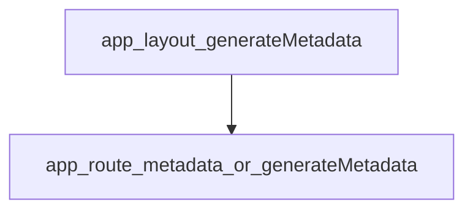

# SEO system — Sokany Store

## العربية

الـ SEO في المشروع يعتمد على **`metadata` في App Router**: الجذر يضبط القالب الافتراضي و`metadataBase` وجزءاً من OG/Twitter، والصفحات الفرعية تضيف أو تستبدل العنوان والوصف و`robots` و`canonical` حسب الحاجة. **JSON-LD** يُحقَن عبر مكوّنات في `components/seo/`. **خريطة الموقع** و**robots.txt** ملفات مسار في `app/`.

**الهوية مقابل كلمات البحث:** قبل تغيير العلامة أو العناوين، اقرأ [`docs/project-vision.md`](project-vision.md).

**المرجع التفصيلي (جداول الملفات):** [`docs/seo-reference.md`](seo-reference.md) — يبقى المصدر الأدق لقائمة المسارات و`metadata`؛ حدّثه مع أي PR يغيّر المسارات.

---

## English — Metadata inheritance

Child routes **merge / override** parent `metadata` from [`app/layout.tsx`](../app/layout.tsx) (`generateMetadata`, `generateViewport`). If a leaf page does not define metadata, it **inherits** the root defaults.

**URL helpers:** [`lib/site.ts`](../lib/site.ts) — `getSiteUrl()`, `toAbsoluteSiteUrl()` using `NEXT_PUBLIC_SITE_URL` (or Vercel) for canonicals and absolute OG URLs.

**Root layout note:** `requestMetadataBase()` uses request host / `x-forwarded-*` so relative icon paths resolve correctly in dev — see comment in [`app/layout.tsx`](../app/layout.tsx).

---

## English — Sitemap & robots

| File | Role |
|------|------|
| [`app/sitemap.ts`](../app/sitemap.ts) | Dynamic sitemap; `revalidate = 3600` |
| [`app/robots.ts`](../app/robots.ts) | `robots.txt`, disallow sensitive paths, sitemap link |
| [`features/seo/services/getSitemapInventory.ts`](../features/seo/services/getSitemapInventory.ts) | Product ids + category slugs for sitemap (cached with Woo tags) |

---

## English — JSON-LD components

| Component | Used on |
|-----------|---------|
| [`components/seo/OrganizationJsonLd.tsx`](../components/seo/OrganizationJsonLd.tsx) | Root layout |
| [`components/seo/WebSiteJsonLd.tsx`](../components/seo/WebSiteJsonLd.tsx) | Root layout |
| [`components/seo/ProductJsonLd.tsx`](../components/seo/ProductJsonLd.tsx) | Product PDP |
| [`components/seo/BreadcrumbJsonLd.tsx`](../components/seo/BreadcrumbJsonLd.tsx) | Product + category |

Organization fields may reflect CMS / control branding where wired.

---

## English — Patterns to remember

- **Search results:** typically `robots.index: false` — e.g. [`app/(storefront)/search/page.tsx`](../app/(storefront)/search/page.tsx) (see [`docs/seo-reference.md`](seo-reference.md)).
- **Control:** [`app/control/layout.tsx`](../app/control/layout.tsx) — `robots: { index: false, follow: false }` for entire `/control` tree.
- **PWA manifest:** [`app/manifest.ts`](../app/manifest.ts) affects **install** UX, not a substitute for HTML meta — see [`docs/pwa-behavior.md`](pwa-behavior.md).

---

## Related

- [`docs/seo-reference.md`](seo-reference.md) — file/route checklist
- [`docs/project-vision.md`](project-vision.md) — brand vs SEO intent
- [`docs/tech-audit.md`](tech-audit.md) — historical metadata / UX audit notes
- [`docs/image-specs.md`](image-specs.md) — OG / product imagery constraints
