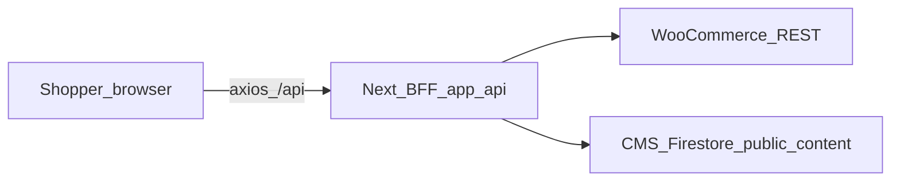

# Sokany Store — Full storefront audit report

**Language rule:** **English** for paths (`app/(storefront)/page.tsx`), component names, API routes, env vars, and identifiers. **Arabic Egyptian** for short business/shopper-facing notes (revenue, trust, operations).

**Related docs:** [`docs/architecture.md`](architecture.md), [`docs/woo-integration.md`](woo-integration.md), [`docs/caching-strategy.md`](caching-strategy.md), [`docs/pwa-behavior.md`](pwa-behavior.md), [`docs/seo-system.md`](seo-system.md).

---

## 1. Current architecture summary

**English (technical)**

- **Stack:** Next.js **16** App Router, React 19, TanStack Query, Zustand, Zod, Axios BFF, Tailwind 4 (`package.json`).
- **Storefront shell:** Routes under `app/(storefront)/` with shared layout `app/(storefront)/layout.tsx` (`SiteShell`, JSON-LD, skip link).
- **Root layout:** `app/layout.tsx` — fonts (Cairo/Montserrat), `QueryProvider`, PWA install provider, network status, view transitions, optional GA/Speed Insights, `components/client-performance-marks.tsx`.
- **BFF pattern:** Browser → `lib/api-client.ts` (`baseURL: "/api"`) → `app/api/*` → `lib/create-woo-client.ts` (server-only Woo REST). Documented in `docs/architecture.md`, `docs/woo-integration.md`.
- **Feature layout:** Domain code in `features/<domain>/` (products, categories, cart, checkout, orders, reviews, CMS, control, etc.) per `.cursorrules`.
- **Data flow (reads):** Server Components / `generateMetadata` + optional `HydrationBoundary` in `app/(storefront)/page.tsx` with prefetched queries; client hooks `features/products/hooks/useProducts.ts`, `useProduct.ts`, etc. → services → `/api/*`.
- **Data flow (writes):** Mutations (e.g. `features/checkout/hooks/useCheckoutOrderMutation.ts`, reviews) → `/api/orders`, `/api/reviews`, etc.
- **Admin:** `/control/*` UI + `app/api/control/*` (session via JWT cookie per `lib/control-session.ts`, `lib/api-control-auth.ts`).
- **Edge protection:** `/control/*` (except `/control/login`) is enforced by [`proxy.ts`](../proxy.ts) — in **Next.js 16** this is the supported **App Router proxy** entry (replacing the deprecated root `middleware.ts`). Do not add both files: the build fails with `middleware-to-proxy`.

**Arabic Egyptian (business)**

- الفكرة إن المتجر يفضل **أمان**: مفاتيح WooCommerce على السيرفر بس، والعميل يكلم **نفس الدومين** تحت `/api`. ده مهم جداً لثقة العميل ولتقليل مخاطر تسريب بيانات الربط مع ووردبريس.



---

## 2. Critical issues

| ID | Area | Finding | Why it matters |
|----|------|---------|----------------|
| C1 | Security / routing | **Clarification (Next.js 16):** `proxy.ts` with a named `proxy` export **is** the framework entry for request interception (`middleware-to-proxy` migration). A root `middleware.ts` must **not** coexist with `proxy.ts` (build error). Earlier audits that assumed only `middleware.ts` runs were **incorrect for this repo/version**. | **للتشغيل:** تأكد إن النشر يستخدم نفس إصدار Next وإن `proxy.ts` موجود في الجذر؛ متضفش `middleware.ts` جنبه. حماية `/control` تعتمد على `config.matcher` في `proxy.ts`. |
| C2 | SEO / structured data | `components/seo/ProductJsonLd.tsx` used fixed `priceValidUntil` (`2030-12-31`) and hardcoded brand/seller. **Improved:** dynamic `priceValidUntil` (ISO year cap) + optional `brandName` / `sellerName` props from CMS/branding at PDP. | Google Rich Results / trust: بيانات أدق تقلل مخاطر الـ snippet المضلل. |
| C3 | Architecture vs docs | Wholesale/PWA-per-segment in `docs/wholesale-retail-access.md` is a **decision spec**, not full product implementation in code. | أي stakeholder يفترض إن «الجملة منفصلة» موجودة في المتجر — **لسه محتاجة قرار بيانات ومسارات**. |

---

## 3. WooCommerce integration (audit)

**Strengths**

- **Server client:** `lib/create-woo-client.ts` — timeout, **GET-only retries** (502/503/504 + network codes); comments warn against POST retry duplication.
- **BFF caching:** `unstable_cache` on list reads e.g. `app/api/products/route.ts` with tags from `lib/woocommerce-cache-tags.ts`, TTL from `lib/woo-bff-revalidate.ts`.
- **Webhook path:** `app/api/webhooks/woocommerce/route.ts` + `features/woocommerce/revalidate-after-product-webhook.ts` + `lib/woocommerce-revalidate-broadcast.ts`.
- **Fallback:** `lib/woo-bff-mock-fallback.ts` — mock in dev if env missing, or when `NEXT_PUBLIC_USE_MOCK`.
- **Cart:** Client-only cart in Zustand `features/cart/store/useCartStore.ts`, `hooks/useCart.ts` with hydration guard; checkout maps to Woo via `useCheckoutOrderMutation` → `features/orders/services/createOrder.ts` → `POST app/api/orders/route.ts`.

**Risks / gaps**

- **Stale vs fresh:** طبقات كاش (server `unstable_cache`, ISR `revalidate` على الهوم، SW، `localStorage` في `api-client`) — لازم سياسة واضحة لما السعر/المخزون يتغير عشان العميل مايشوفش سعر غلط.
- **Client `localStorage` cache** (`lib/storefront-api-cache-policy.ts`): يغطي GETs محددة فقط؛ مناسب للـ resilience لكن محتاج مراجعة **مدة الصلاحية** (7 days in `lib/api-client.ts`) مقابل تجارة إلكترونية.

**Arabic Egyptian**

- لما Woo يقع أو يبطئ، عندكم **شبكة أمان** (retry + mock في dev + كاش محلي للـ GET). ده حلو للاستقرار، بس في الإنتاج لازم تتأكد إن العميل **مش هيفضل شايف مخزون أو سعر قديم** بعد ما الويبهوك يصلح الداتا.

---

## 4. Performance

**Observations**

- **Client boundary:** كبير — عشرات الملفات تحت `"use client"` (مثال: `features/products/components/ProductCard.tsx` ~900+ lines مع dynamic import لـ quick view، animations، prefetch).
- **Virtualization:** `features/products/components/VirtualizedProductGrid.tsx` موجود للكتالوج الثقيل.
- **Images:** `components/AppImage.tsx` + `next/image` remote patterns في `next.config.ts` (Woo hosts + site URL + storage).
- **Bundle analysis:** `npm run analyze` / `ANALYZE=true` wired in `package.json`. See §18 for a baseline run note (re-run after dependency changes).
- **Mobile / WebKit:** توثيق واختبار في `docs/webview-in-app-browsers.md`, `tests/mobile_scroll_webkit.spec.ts`; PWA behind `NEXT_PUBLIC_ENABLE_SW` في `components/PwaEngagementStack.tsx` (per docs).

**Performance risks**

- **Hydration + Query restore:** `providers/QueryProvider.tsx` يستعيد كاش من `localStorage` بعد idle — يحسن الإحساس بالسرعة لكن يزيد تعقيد التزامن مع السيرفر.
- **Framer Motion + heavy cards:** تكلفة JS على الموبايل؛ يوجد تقليل جزئي (مثلاً CSS burst في `app/globals.css` لـ wishlist).
- **View Transitions:** `next-view-transitions` — راقب **Safari** و**WebView** للسلوك غير المتسق.

---

## 5. PWA / Service Worker

**Current behavior** (from `app/api/pwa-sw/route.ts`, `docs/pwa-behavior.md`)

- **`/sw.js`** rewrite → dynamic SW؛ `Cache-Control: no-store` على الـ script.
- **Cache buckets** prefixed with deploy segment (`VERCEL_DEPLOYMENT_ID` / commit / `NEXT_PUBLIC_SW_CACHE_REVISION`).
- **Navigate:** غير معترض — documents عادية (يقلل مخاطر صفحات قديمة كلها من SW).
- **API GET:** network-first + fallback؛ static network-first ثم cache؛ صور cross-origin SWR.
- **Firebase** في SW اختياري للـ push / invalidation hints.

**Risks**

- **تعدد طبقات الكاش** (SW + localStorage + React Query persistence) — صعوبة تشخيص «ليه العميل لسه شايف حاجة قديمة».
- **Facebook/Instagram WebView:** SW غير موثوق — المتجر لازم يفضل شغال من غيره (موثق).

**Arabic Egyptian**

- استراتيجية الـ SW **متقدمة وواعية بالنشر** (اسم كاش يتغير مع الـ deploy). ده مهم جداً عشان مايحصلش كابوس «العميل معاه نسخة قديمة من المتجر» بعد تحديث.

---

## 6. UI/UX (high-level)

- **Product cards:** `features/products/components/ProductCard.tsx` — variants للموبايل/الديسكتوب، quick view اختياري، wishlist، prefetch.
- **Home:** `app/(storefront)/page.tsx` ي prefetch rails عبر `getProductsListServer` + `HomePageShell` / `components/pages/home/HomePageInteractiveClient.tsx`.
- **Category / PDP / cart / checkout:** تجميع في `components/pages/*PageContent.tsx` + `features/*` (راجع تعليقات الـ layout العربية في الملفات حسب `.cursorrules`).
- **Toasts:** `sonner` عبر `providers/ToastProvider.tsx` + `hooks/useCart.ts`.
- **Search:** صفحة `app/(storefront)/search/page.tsx` + `components/layout/navbar-search.tsx` + اقتراحات سريعة من CMS في الـ layout.

**Arabic Egyptian**

- تجربة الموبايل فيها طبقات كروم ثابتة وسكرول معقد — ده ممكن يدي إحساس «تطبيق» قوي، بس لازم يفضل **إبهام المستخدم** يوصل للأزرار المهمة (سلة، بحث، اتصال) من غير تضارب مع الـ safe area.

---

## 7. Design system

- **Tokens:** CSS variables في `app/globals.css` (`--sokany-accent`, semantic colors, motion tokens aligned with `lib/motion.ts`).
- **Components:** `components/ui/*` (shadcn-style patterns: `components/ui/button.tsx`, `components/ui/card.tsx`, etc.).
- **Dark mode:** لا يظهر نظام `dark:` شامل في الجزء الأساسي من `globals.css` — افتراض **فاتح** مع متغيرات جاهزة للتوسع.
- **Duplication risk:** كروشيهات Tailwind طويلة على بطاقات/كروم الموبايل؛ فرصة لـ `cn()` + tokens أو مكوّنات فرعية صغيرة بدل تكرار الـ class strings.

---

## 8. SEO

- **Metadata:** تسلسل من `app/layout.tsx` + صفحات فرعية؛ `metadataBase` ديناميكي من الهيدر للأيقونات/الروابط المطلقة.
- **Sitemap / robots:** `app/sitemap.ts`, `app/robots.ts`، مخزون من `features/seo/services/getSitemapInventory.ts`.
- **JSON-LD:** Organization/WebSite في الـ layout؛ Product على PDP — انظر §2 C2 والتحسينات في `ProductJsonLd`.
- **Reference:** `docs/seo-system.md`, `docs/seo-reference.md`.

**Arabic Egyptian**

- الـ SEO مربوط بالهوية من الـ CMS — ده كويس للتسويق، بس لازم **المنتج** يفضل دقيق في الـ schema (سعر، توفر، صور) عشان نتائج جوجل تبقى قوية في مصر.

---

## 9. Accessibility

- **Skip link:** `components/layout/skip-to-main-content.tsx` في storefront layout.
- **Automated tests:** `tests/a11y-axe.spec.ts` — home, catalog, mock PDP (serious/critical violations).
- **Drawers / mega menu:** `focus-trap-react` في dependencies؛ يحتاج مراجعة يدوية للميجا مينو (`components/layout/desktop-category-mega-nav.tsx`) والأدراج الموبايل (`components/layout/mobile-nav-drawer.tsx`).

**Arabic Egyptian**

- الاختبار الآلي خطوة ممتازة، بس **التباين والقائمة الكبيرة** محتاجين عين بشرية علشان العميل اللي بيستخدم قارئ شاشة يقدر يتسوق براحة.

---

## 10. Code quality and cleanup

- **Docs proliferation:** ملفات مثل `docs/cleanup-report.md`, `docs/enterprise-audit-2026.md` — راجع مع هذا التقرير لتجنب **تكرار** و«مصدر حقيقة» واحد لكل موضوع.
- **Large files:** `features/products/components/ProductCard.tsx` مرشح لتقسيم داخلي (media rail / actions / pricing) بدون تغيير سلوك.
- **Scripts:** `scripts/check-no-woo-secrets-in-client-trees.mjs` — جيد للحوكمة.

---

## 11. Business features

- **Wholesale/retail:** `docs/wholesale-retail-access.md` — spec فقط؛ لا تفترض تنفيذ في الكود حتى يختار الفريق موديل Woo.
- **Hotline / contact:** `features/store/hooks/useStoreHotline.ts`, `app/api/store/hotline/route.ts` + مكوّنات موبايل (مثلاً `components/layout/mobile-store-hotline.tsx`).
- **PWA per segment:** غير منفذ في الكود حسب الـ spec؛ manifest حالي `app/manifest.ts` من CMS.

**Arabic Egyptian**

- لو المستقبل فيه **جملة وموردين**، القرار التجاري والتقني لازم ييجي قبل ما نبني مسارات جديدة — عشان ما نكسرش الـ SEO ولا نفتح ثغرات وصول.

---

## 12. High-impact improvements (prioritized)

1. **Structured data — next steps** — دعم `Offer` للبيع (`sale_price` vs `regular_price`) و`AggregateOffer` لو متغيرات متعددة؛ ربط `priceValidUntil` بسياسة تسويق معتمدة (حالياً نافذة متحركة ~365 يوم + أسماء brand/seller من الـ CMS على الـ PDP).
2. **Cache coherence playbook** — جدول: ماذا يحدث عند تغيير سعر/مخزون (webhook → tags → client invalidation → SW → localStorage).
3. **ProductCard / catalog JS budget** — قياس `analyze` ثم تقسيم أو تأجيل أكثر للـ quick view والحركات على الموبايل.
4. **Expand a11y coverage** — axe على checkout، category، drawers؛ اختبار لوحة مفاتيح للميجا مينو.

---

## 13. Safe quick wins

- تشغيل `npm run analyze` مرة وتسجيل أكبر 5 chunks (§18).
- مراجعة `STALE_TIME` / `revalidate` للهوم مقابل سياسة الأسعار.
- ربط هذا الملف من `README.md` تحت قسم التوثيق إذا رغبت بمصدر audit واحد.
- إعادة تشغيل فحص يدوي لـ `/control` غير المسجّل (يتأكد إن `proxy.ts` شغال في بيئة النشر).

---

## 14. Risky changes (need review)

- تغيير استراتيجية SW أو حذف طبقة كاش من المتصفح.
- تقليل retries أو تعطيل mock fallback paths في dev/staging.
- المساس بـ `api-client` persistence (قد يغير سلوك «offline» للمستخدمين الحاليين).
- إضافة مكتبات ثقيلة جديدة — يبررها حجم الفائدة مقابل الموبايل.

---

## 15. Suggested phased roadmap

| Phase | Focus | Outcomes |
|-------|--------|----------|
| **0 — Verify (أسبوع)** | أمان `/control`، فحص إنتاج للـ SW وكاش العميل | لا ثغرات واضحة؛ توثيق دقيق |
| **1 — Trust & SEO (2–3 أسابيع)** | Product JSON-LD متقدم، canonicals، مراجعة sitemap | تحسين Rich Results |
| **2 — Performance (متدرج)** | تحليل bundle، تخفيف `ProductCard`، صور | LCP/INP أفضل على الموبايل |
| **3 — UX polish** | thumb zones، checkout خطوات، loading consistency | تحويل أعلى |
| **4 — Wholesale (اختياري)** | بعد قرار البيانات في Woo | مسارات وعزل و SEO |

---

## 16. Files likely affected (by theme)

- **Proxy / control:** `proxy.ts`, `docs/architecture.md`, `docs/control-woo-api.md`
- **Woo BFF:** `app/api/products/route.ts`, `app/api/categories/route.ts`, `lib/create-woo-client.ts`, `lib/woocommerce-revalidate-broadcast.ts`
- **PWA:** `app/api/pwa-sw/route.ts`, `components/PwaEngagementStack.tsx`, `lib/storefront-offline-cache.ts`
- **Performance / UI:** `features/products/components/ProductCard.tsx`, `features/products/components/VirtualizedProductGrid.tsx`, `components/AppImage.tsx`
- **SEO:** `components/seo/ProductJsonLd.tsx`, `app/sitemap.ts`, `app/(storefront)/categories/[slug]/page.tsx`, `app/(storefront)/products/[id]/page.tsx`
- **A11y:** `components/layout/desktop-category-mega-nav.tsx`, `components/layout/mobile-nav-drawer.tsx`, `tests/a11y-axe.spec.ts`

---

## 17. Risk register (short)

| Type | Risk |
|------|------|
| **Woo** | تعطل upstream، تعقيد الكاش، تكرار طلبات غير idempotent |
| **PWA/Safari** | SW/WebView سلوك مختلف؛ كاش قديم يظهر كـ «باجي» |
| **Performance** | JS كثير على الموبايل؛ صور Woo كبيرة |
| **SEO** | schema غير دقيق؛ duplicate أو stale OG إذا CMS غير متزامن |

---

## 18. Bundle analysis baseline

Run locally after installs:

```bash
npm run analyze
```

**Outputs (webpack):** open `.next/analyze/client.html` in a browser for the client bundle treemap; `nodejs.html` / `edge.html` for server/edge graphs. The CLI may print *"No bundles were parsed"* — the HTML reports still reflect module sizes from the stats file.

**Likely regression targets (code-structure, not pinned sizes):**

- `features/products/components/ProductCard.tsx` (quick view dynamic import, gallery, wishlist burst)
- `framer-motion` consumers (checkout celebration, marketing sections)
- `components/layout/*` mobile commerce chrome (sticky layers + drawers)

Re-run after major refactors; gzip/brotli sizes vary by Next version and dynamic imports.

---

*Last updated: audit implementation pass (Next 16 `proxy.ts` clarification, `ProductJsonLd` branding + rolling `priceValidUntil`, this document).*
