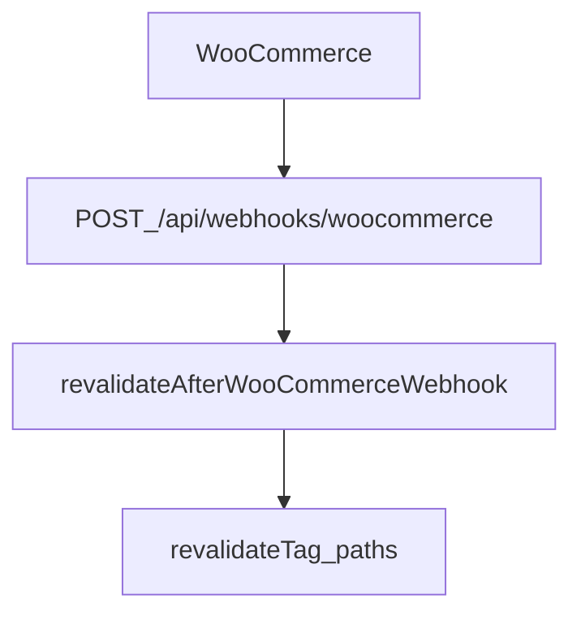

# WooCommerce integration — Sokany Store

## العربية

الربط **headless**: الكتالوج والطلبات يبقيان في WordPress/WooCommerce، والمتجر يستهلك **WooCommerce REST API** عبر خادم Next فقط. هذا يمنع تسريب **Consumer Secret** للمتصفح. وضع **`NEXT_PUBLIC_USE_MOCK`** يسمح بتطوير الواجهة بدون متجر حي.

**الويبهوك:** Woo يرسل `POST` إلى `/api/webhooks/woocommerce` مع توقيع؛ بعد التحقق يُستدعى إبطال الكاش ومسارات محددة (منتجات، تصنيفات، طلبات، مراجعات). الإعداد التفصيلي للوحة التحكم والمزامنة: [`docs/control-woo-api.md`](control-woo-api.md).

**صيانة:** جدول المسارات الكامل في [`docs/api-integration-inventory.md`](api-integration-inventory.md) — حدّثه عند إضافة `app/api/*`.

---

## English — Environment (server-only vs public)

| Variable | Role |
|----------|------|
| `WC_BASE_URL` | WordPress origin (server only) |
| `WC_CONSUMER_KEY` / `WC_CONSUMER_SECRET` | Woo REST Basic auth (server only) |
| `NEXT_PUBLIC_USE_MOCK` | `true` = mock catalog/checkout paths |
| `WC_WEBHOOK_SECRET` | Verifies `x-wc-webhook-signature` on `POST /api/webhooks/woocommerce` |
| `WOO_BFF_CACHE_REVALIDATE_SEC` | Optional bounds for BFF `unstable_cache` TTL (60–3600); see [`lib/woo-bff-revalidate.ts`](../lib/woo-bff-revalidate.ts) |

Full env list: [`.env.local.example`](../.env.local.example), [`README.md`](../README.md).

---

## English — Client → BFF

Browser uses `apiClient` with `baseURL: "/api"` ([`lib/api-client.ts`](../lib/api-client.ts)). Typical domains:

- Products, categories, reviews, auth, orders, store hotline — see the **trimmed** map below; full table in [`docs/api-integration-inventory.md`](api-integration-inventory.md).

| Domain | Example service | Route |
|--------|-----------------|-------|
| Products | `features/products/services/getProducts.ts` | `GET /api/products` |
| Product by id | `getProductById.ts` | `GET /api/products/:id` |
| Categories | `getCategories.ts` | `GET /api/categories` |
| Reviews | `getReviews.ts` / `createReview.ts` | `GET/POST /api/reviews` |
| Auth | `login.ts`, `register.ts`, … | `POST /api/auth/*` |
| Orders | `createOrder.ts`, `fetchMyOrders.ts`, `trackOrder.ts` | `POST/GET /api/orders`, `GET /api/orders/track` |

JWT: `Authorization: Bearer` from Zustand when token present (exceptions documented in inventory).

---

## English — Server Woo client & validation

- Axios client: [`lib/create-woo-client.ts`](../lib/create-woo-client.ts)
- Response shapes: Zod schemas under [`schemas/`](../schemas/) (e.g. `wordpress`) — parse at boundary in services / route handlers

---

## English — Webhooks & revalidation

**Endpoint:** [`app/api/webhooks/woocommerce/route.ts`](../app/api/webhooks/woocommerce/route.ts)

1. Requires `WC_WEBHOOK_SECRET`; verifies signature via [`lib/verify-woocommerce-webhook-signature.ts`](../lib/verify-woocommerce-webhook-signature.ts).
2. Calls [`features/woocommerce/revalidate-after-product-webhook.ts`](../features/woocommerce/revalidate-after-product-webhook.ts) `revalidateAfterWooCommerceWebhook(topic, payload)` which uses [`lib/woocommerce-revalidate-broadcast.ts`](../lib/woocommerce-revalidate-broadcast.ts) (`revalidateTag`, `revalidatePath`) per topic (`product.*`, `product_cat.*`, `order.*`, review-related).
3. Optional FCM client hint: `sendWooCacheInvalidation`; delivery logging: `recordWooWebhookDelivery`.

**External data webhook** (HMAC): separate route and `revalidateAfterExternalDataWebhook()` — see inventory.

---

## Related

- [`docs/caching-strategy.md`](caching-strategy.md) — cache tags and TTLs
- [`docs/control-woo-api.md`](control-woo-api.md) — `/control?tab=wooApi` diagnostics & webhook sync UI
- [`docs/architecture.md`](architecture.md) — BFF overview
